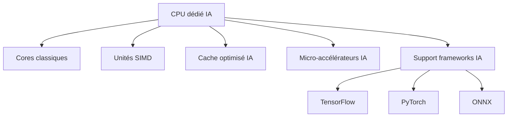
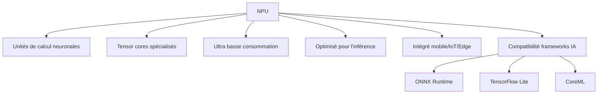
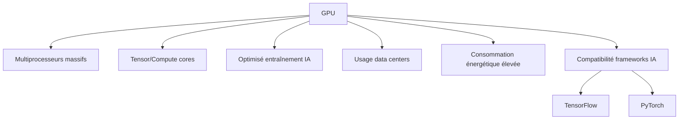

    
  
  
  
    
  
  <h2>Laboratoire numérique pour la cybersécurité, Linux & IT.</h2>

  

    
    
    
    
    
    
  

  

  

    <strong>Cybersécurité</strong>  • <strong>Linux Debian</strong>  • <strong>Sécurité informatique</strong> 
  

---

  
## À propos & Objectifs.

Ce projet propose des solutions innovantes et accessibles en cybersécurité, avec une approche centrée sur la simplicité d’utilisation et l’efficacité. Il vise à accompagner les utilisateurs dans la protection de leurs données et systèmes, tout en favorisant l’apprentissage et le partage des connaissances.

Le contenu est structuré, accessible et optimisé SEO pour répondre aux besoins de :
- 🎓 Étudiants : approfondir les connaissances
- 👨‍💻 Professionnels IT : outils et pratiques
- 🖥️ Administrateurs système : sécuriser l’infrastructure
- 🛡️ Experts cybersécurité : ressources techniques
- 🚀 Passionnés du numérique : explorer les bonnes pratiques

---

> Guide complet expliquant, étape par étape, le fonctionnement, l’installation et l’utilisation de solutions d’intelligence artificielle sur Debian 12 et Debian 13.

---

### **Sommaire**

🟢 **Actif** – Dépôt totalement accessible  
🟠 **Partiel** – Dépôt partiellement accessible  
🔴 **Inactif** – Dépôt inaccessible ou indisponible

---

  
# Architectures des processeurs dédiés à l’Intelligence Artificielle

L’intelligence artificielle a révolutionné la conception des processeurs. Aujourd’hui, on distingue plusieurs architectures matérielles pensées spécifiquement pour les tâches de l’IA : les CPUs optimisés, les NPUs spécialisés et les GPUs massivement parallèles.  
Comprendre leurs rôles et leurs interactions permet de mieux choisir le matériel adapté à vos besoins IA (inférence, entraînement, embarqué, edge, data center, etc.).

---

## Schéma du CPU dédié IA

---

## Schéma du NPU (Neural Processing Unit)

---

## Schéma du GPU (Graphics Processing Unit) pour IA

---

## Explications des architectures

- **CPU dédié IA**  
  Processeur central traditionnel, modifié pour intégrer des instructions SIMD (vectorisation), caches plus rapides, et des accélérateurs IA intégrés. Prise en charge optimale des frameworks modernes, souvent le cœur des appareils grand public et IoT.
  
- **NPU (Neural Processing Unit)**  
  Puce spécialisée pour les réseaux de neurones, conçue pour exécuter l’inférence rapide et efficiente (très basse consommation). Essentielle pour les smartphones, robots, objets embarqués. Constituée de “tensor cores” pour accélérer les calculs.
  
- **GPU (Graphics Processing Unit)**  
  Processeur massivement parallélisé, initialement pour le graphisme mais parfait pour l’entraînement deep learning sur gros volumes de données (data centers). Dispose de milliers de cœurs, plus adapté à la recherche ou aux serveurs IA puissants.

---

**À retenir :**  
Chaque architecture a ses points forts : le CPU IA est polyvalent, le NPU est ultra-efficace pour l’embarqué, et le GPU est roi pour l’entraînement massif.  
L’évolution matérielle IA bénéficie souvent de leur collaboration pour maximiser vitesse, efficacité, et coût énergétique.

---

  

  <b>🔒 Un guide proposé par <a href="https://github.com/0xCyberLiTech">0xCyberLiTech</a> • Pour des tutoriels accessibles à tous. 🔒</b>

