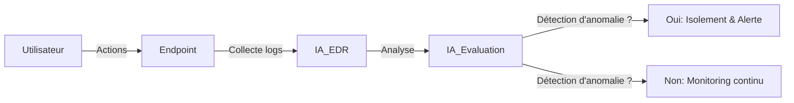
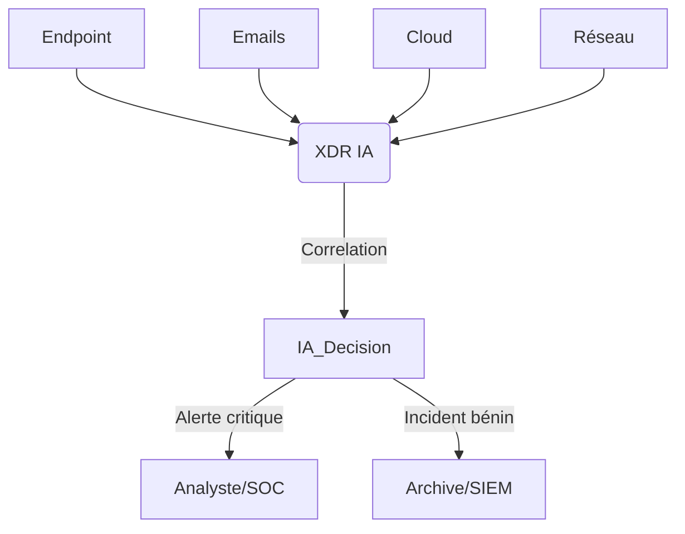
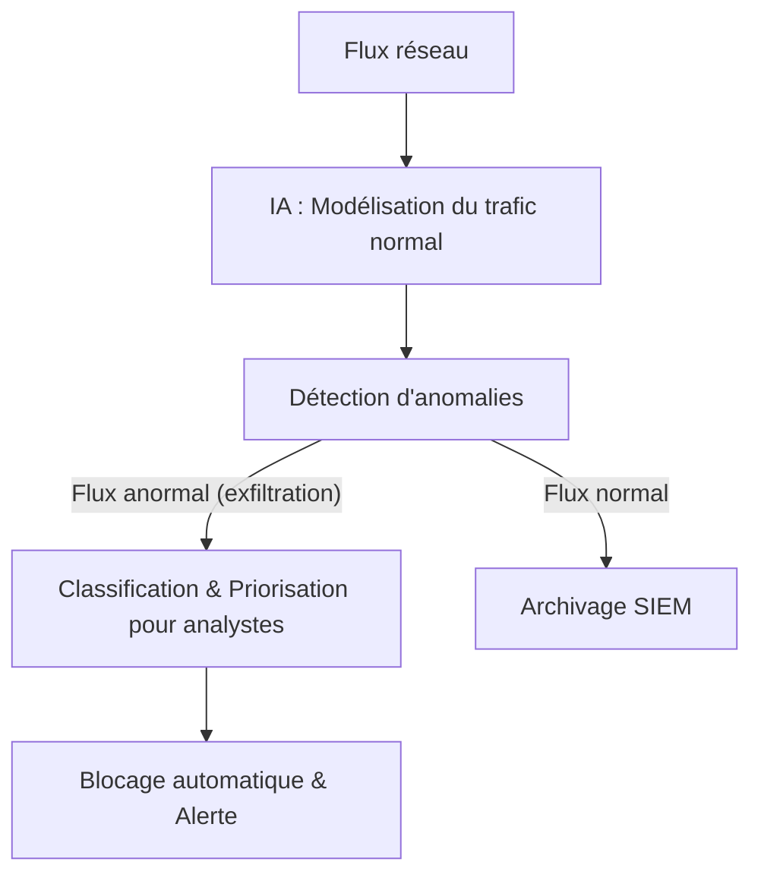
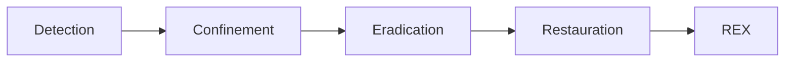

    
  
  
  
    
  
  <h2>Laboratoire numérique pour la cybersécurité, Linux & IT.</h2>

  

    
    
    
    
    
    
  

  

  

    <strong>Cybersécurité</strong>  • <strong>Linux Debian</strong>  • <strong>Sécurité informatique</strong> 
  

---

  
## À propos & Objectifs.

Ce projet propose des solutions innovantes et accessibles en cybersécurité, avec une approche centrée sur la simplicité d’utilisation et l’efficacité. Il vise à accompagner les utilisateurs dans la protection de leurs données et systèmes, tout en favorisant l’apprentissage et le partage des connaissances.

Le contenu est structuré, accessible et optimisé SEO pour répondre aux besoins de :
- 🎓 Étudiants : approfondir les connaissances
- 👨‍💻 Professionnels IT : outils et pratiques
- 🖥️ Administrateurs système : sécuriser l’infrastructure
- 🛡️ Experts cybersécurité : ressources techniques
- 🚀 Passionnés du numérique : explorer les bonnes pratiques

---

> Guide complet expliquant, étape par étape, le fonctionnement, l’installation et l’utilisation de solutions d’intelligence artificielle sur Debian 12 et Debian 13.

---

### **Sommaire**

🟢 **Actif** – Dépôt totalement accessible  
🟠 **Partiel** – Dépôt partiellement accessible  
🔴 **Inactif** – Dépôt inaccessible ou indisponible

---

  
# 1. Introduction à la cybersécurité et à l’IA

La cybersécurité protège les systèmes informatiques contre les menaces numériques. L’intelligence artificielle (IA) révolutionne ce domaine en permettant l’automatisation de la détection, de l’analyse et de la réaction face aux attaques, rendant la défense plus rapide, évolutive et efficace.

---

## L’IA au cœur des architectures EDR, XDR et NDR

L’IA est devenue l’élément clé des architectures modernes :  
- Elle automatise l’analyse de millions de données contextuelles.
- Elle apprend en continu des nouveaux scénarios d’attaque.
- Elle réagit en quelques secondes, bien plus vite que l’humain seul.

---

### 1. EDR (Endpoint Detection & Response) BOOSTÉ PAR L’IA

- **Surveillance comportementale** :  
  L’IA examine en temps réel chaque action sur le poste (fichiers ouverts, processus lancés, connexions, etc.) et détecte d’anomalies invisibles aux outils traditionnels.
- **Détection proactive** :  
  Le machine learning repère les attaques nouvelles, y compris celles sans signature.
- **Réponse automatisée** :  
  L’IA peut confiner un poste, supprimer un fichier ou alerter un analyste instantanément.

**Exemple** :  
Un accès et des modifications anormales de fichiers par un utilisateur sont reconnus : le terminal est isolé en quelques secondes.

**Schéma interactif (EDR décision automatisée)**

---

### 2. XDR (Extended Detection & Response) PORTÉ PAR L’IA

- **Corrélation multi-sources** :  
  L’IA analyse en simultané endpoints, réseau, cloud, emails et détecte des schémas d’attaque globaux impossibles à voir manuellement.
- **Réduction de la fatigue des alertes** :  
  L’IA regroupe, classe et priorise les incidents pour se concentrer sur les menaces réelles.
- **Orchestration de la réaction** :  
  Playbooks de réponse automatiques, déclenchés selon le contexte.

**Exemple** :  
L’IA détecte la combinaison de connexions inhabituelles sur un endpoint, un accès cloud suspect et un mail suspect : XDR bloque l’accès et alerte le SOC.

**Schéma interactif (XDR corrélation avancée)**

---

### 3. NDR (Network Detection & Response) AUGMENTÉ PAR L’IA

- **Apprentissage du comportement réseau** :  
  L’IA modélise le trafic "normal" pour chaque environnement et détecte immédiatement toute activité suspecte ou inconnue (command & control, exfiltration).
- **Détection d’anomalies sans signature** :  
  Les algorithmes non supervisés révèlent des techniques d’attaque inédites.
- **Classification & priorisation pour les analystes** :  
  L’IA simplifie l’investigation face à de vastes volumes de données.

**Exemple** :  
Un flux persistant à faible volume vers une IP rare est découvert : l’IA NDR catégorise cela comme exfiltration potentielle et lance un blocage automatique.

**Schéma interactif (NDR détection d'exfiltration)**

---

**En résumé**  
L’IA permet à ces briques de :  
- Détecter l’insoupçonnable  
- Accélérer la réponse  
- Soulager les analystes  
- Optimiser la sécurité globale, même pour les menaces les plus modernes

---

# 2. Les fondamentaux de la cybersécurité

- **Menaces courantes** : malware, ransomware, phishing, exploits zero-day  
- **Acteurs malveillants** : cybercriminels, hacktivistes, insiders  
- **Principes de défense** : prévention, détection, réaction, traçabilité

---

# 3. Intelligence artificielle en cybersécurité

- **Automatisation** : surveillance & réponse proactive  
- **Machine Learning** : classification de comportements suspects  
- **Analyse prédictive** : anticipation de nouveaux types d’attaques  
- **Threat Intelligence** : enrichissement des alertes, veille automatisée

**Exemple** :  
Une IA repère un comportement réseau inhabituel et enclenche automatiquement une analyse approfondie ou un confinement du poste concerné.

---

# 4. Architectures EDR, XDR et NDR (Résumé visuel)

- **EDR** : Protection terminale (voir schéma ci-dessus)
- **XDR** : Vision globale et automatisation (voir schéma ci-dessus)
- **NDR** : Surveillance & blocage réseau (voir schéma ci-dessus)

---

# 5. Réponse aux incidents

**Étapes typiques :**  
1. Détection  
2. Confinement  
3. Éradication  
4. Restauration  
5. Retour d’expérience (REX)

**Schéma interactif (Cycle incident)**

---

# 6. Cas interactifs et pédagogiques

- **EDR** : Détection d’exécution de script PowerShell malveillant
- **XDR** : Orchestration post-phishing multi-vector
- **NDR** : Blocage automatique d’un tunnel SSH non autorisé

---

# 7. Ressources complémentaires

- [ANSSI](https://www.ssi.gouv.fr)
- [MITRE ATT&CK](https://attack.mitre.org/)
- [NIST Cybersecurity Framework](https://www.nist.gov/cyberframework)
- [OWASP Top 10](https://owasp.org/www-project-top-ten/)

---

# 8. Glossaire

- **EDR** : Endpoint Detection & Response  
- **XDR** : Extended Detection & Response  
- **NDR** : Network Detection & Response  
- **SOC** : Security Operations Center  
- **Incident Response** : Processus de gestion d’incident  
- **REX** : Retour d’Expérience
---
> **En résumé** : L’IA doit rester un outil au service de l’humain, respectueux de la loi, éthique et transparent. Apprendre l’IA, c’est aussi apprendre à construire un futur technologique plus juste et plus sûr.
---

  

  <b>🔒 Un guide proposé par <a href="https://github.com/0xCyberLiTech">0xCyberLiTech</a> • Pour des tutoriels accessibles à tous. 🔒</b>

