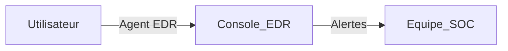
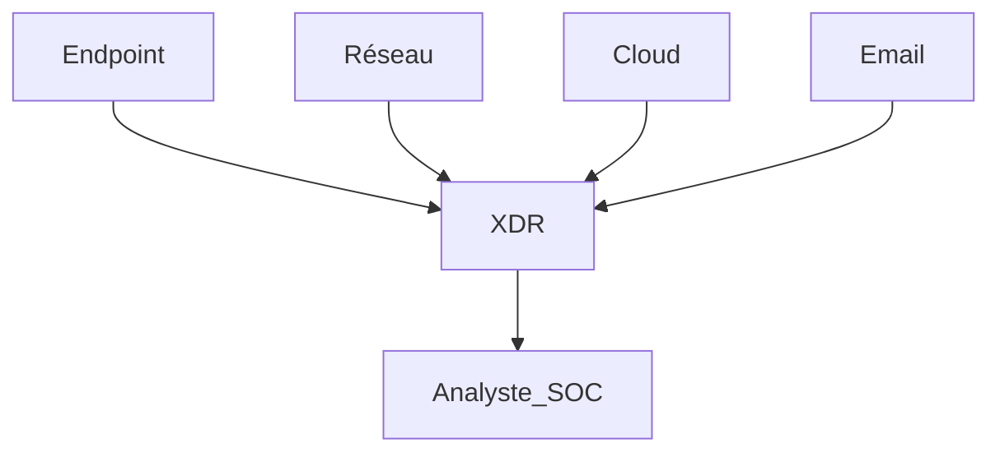
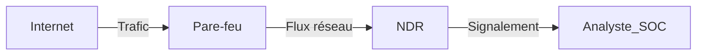
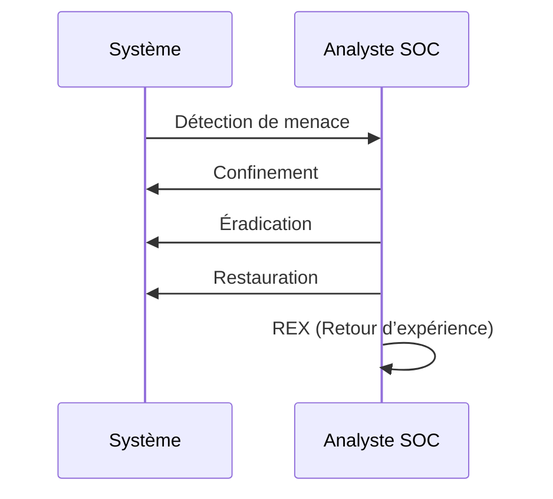

    
  
  
  
    
  
  <h2>Laboratoire numérique pour la cybersécurité, Linux & IT.</h2>

  

    
    
    
    
    
    
  

  

  

    <strong>Cybersécurité</strong>  • <strong>Linux Debian</strong>  • <strong>Sécurité informatique</strong> 
  

---

  
## À propos & Objectifs.

Ce projet propose des solutions innovantes et accessibles en cybersécurité, avec une approche centrée sur la simplicité d’utilisation et l’efficacité. Il vise à accompagner les utilisateurs dans la protection de leurs données et systèmes, tout en favorisant l’apprentissage et le partage des connaissances.

Le contenu est structuré, accessible et optimisé SEO pour répondre aux besoins de :
- 🎓 Étudiants : approfondir les connaissances
- 👨‍💻 Professionnels IT : outils et pratiques
- 🖥️ Administrateurs système : sécuriser l’infrastructure
- 🛡️ Experts cybersécurité : ressources techniques
- 🚀 Passionnés du numérique : explorer les bonnes pratiques

---

> Guide complet expliquant, étape par étape, le fonctionnement, l’installation et l’utilisation de solutions d’intelligence artificielle sur Debian 12 et Debian 13.

---

### **Sommaire**

🟢 **Actif** – Dépôt totalement accessible  
🟠 **Partiel** – Dépôt partiellement accessible  
🔴 **Inactif** – Dépôt inaccessible ou indisponible

---
# Support pédagogique : Cybersécurité & Intelligence Artificielle

---

## Sommaire

1. [Introduction à la cybersécurité et à l’IA](#intro)
2. [Les fondamentaux de la cybersécurité](#fondamentaux)
3. [Intelligence artificielle en cybersécurité](#ia-cyber)
4. [Architectures EDR, XDR et NDR](#architectures)
   - [EDR](#edr)
   - [XDR](#xdr)
   - [NDR](#ndr)
5. [Réponse aux incidents](#incident-response)
6. [Schémas pédagogiques](#schemas)
7. [Cas pratiques IA & cybersécurité](#cas-pratiques)
8. [Ressources complémentaires](#ressources)
9. [Glossaire](#glossaire)

---

## 1. Introduction à la cybersécurité et à l’IA

La cybersécurité vise à protéger les systèmes informatiques contre les menaces numériques. L’IA révolutionne la détection et la réaction face aux attaques, notamment en automatisant l’analyse de gigantesques volumes de données et en adaptant les stratégies défensives.

---

## 2. Les fondamentaux de la cybersécurité

- **Menaces courantes** : malwares, ransomwares, phishing, exploits zero-day
- **Acteurs malveillants** : cybercriminels, hacktivistes, insiders
- **Principes de défense** : prévention, détection, réaction, traçabilité

---

## 3. Intelligence artificielle en cybersécurité

- **Automatisation** : surveillance continue et réponse proactive
- **Machine Learning** : détection d’anomalies, classification de comportements suspects
- **Analyse prédictive** : anticipation de nouveaux types d'attaques
- **Threat Intelligence** : enrichissement des alertes par la veille automatisée

**Exemple :**  
Une IA peut repérer un comportement inhabituel sur le réseau interne et déclencher une analyse poussée ou un isolement du poste concerné.

---

## 4. Architectures EDR, XDR et NDR

### EDR (Endpoint Detection & Response)

L’EDR surveille les terminaux (PC, serveurs...), détecte, analyse et remédie à des menaces avancées.

**Principales fonctions :**
- Monitoring en temps réel
- Enquête forensique
- Isolation des endpoints infectés

**Schéma EDR :**

---

### XDR (Extended Detection & Response)

L'XDR va plus loin que l'EDR en intégrant données endpoint, réseau, cloud et email, pour une vision globale.

**Fonctions clés :**
- Correlation multi-sources
- Automatisation de la réponse
- Orchestration centralisée

**Schéma XDR :**

---

### NDR (Network Detection & Response)

Le NDR surveille le trafic réseau pour détecter des comportements malveillants (mouvements latéraux, exfiltration de données).

**Fonctions principales :**
- Analyse en temps réel des paquets
- Détection d'anomalies réseau
- Réaction automatique (blocage/isolement)

**Schéma NDR :**

---

## 5. Réponse aux incidents

**Étapes typiques :**
1. Détection
2. Containment (confinement)
3. Éradication
4. Restauration
5. Retour d'expérience

**Schéma de gestion d'incident :**

---

## 6. Schémas pédagogiques

- **EDR** : Protection au niveau terminal, réponse locale
- **XDR** : Vision transversale, réponse automatisée multi-domaines
- **NDR** : Surveillance réseau, analyse approfondie des flux

---

## 7. Cas pratiques IA & cybersécurité

- **Détection de phishing par analyse comportementale IA**
- **Détection proactive de ransomware sur endpoint**
- **Réponse automatisée à une exfiltration réseau détectée par NDR**

---

## 8. Ressources complémentaires

- [ANSSI](https://www.ssi.gouv.fr)
- [MITRE ATT&CK](https://attack.mitre.org/)
- [NIST Cybersecurity Framework](https://www.nist.gov/cyberframework)
- [OWASP Top 10](https://owasp.org/www-project-top-ten/)

---

## 9. Glossaire

- **EDR** : Endpoint Detection & Response
- **XDR** : Extended Detection & Response
- **NDR** : Network Detection & Response
- **SOC** : Security Operations Center
- **Incident Response** : Processus de gestion d’incident
- **REX** : Retour d’Expérience

---

  

  <b>🔒 Un guide proposé par <a href="https://github.com/0xCyberLiTech">0xCyberLiTech</a> • Pour des tutoriels accessibles à tous. 🔒</b>

